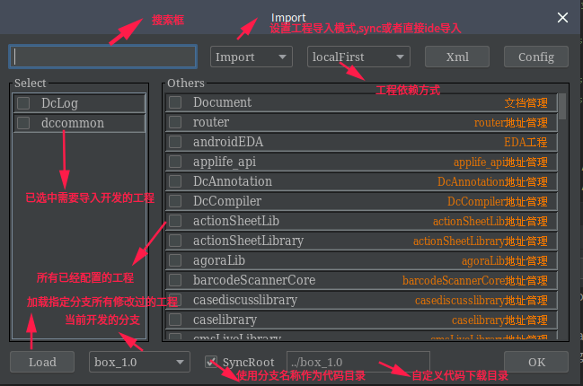

##  组件化管理系统
### 快速集成 
> 1,在Root工程build.gradle目录中,添加以下代码
```
buildscript {
    repositories {
       maven {
            url "https://dl.bintray.com/pqixing86/modularization"
        }
    }
    dependencies {
        classpath 'com.pqixing.gradle:modularization:1.0.0'
    }
} 

apply plugin : "com.module.manager"
manager {
    docRepoUrl = "http://192.168.3.200/android/docRepo.git" //需要设置一个git工程,作为模块文件和版本管理容器
    docRepoUser ""//docGit的用户，如不填，取projectInfo文件中的配置
    docRepoPsw ""//docGit的密码，如不填，取projectInfo文件中的配置
}
```

> 2,同步一下,根目录下会生成Config.java文件,需配置git用户名和密码,其他配置参数见注释
```
public class Config {
    /**
     * 用户名称,可用于git
     */
    public String userName = "pengqixing";

    /**
     * 用户密码,可用于git
     */
    public String passWord = "pengqixing";
}
```

> 3,同步一下,根目录下会生成templet目录,存放通用的配置模板,其中project.xml用来设置需要管理的工程
```
#base地址, 其他Project不设置git url时, 默认以baseUrl/project.git作为url地址
<git baseUrl="http://192.168.3.200/android">
    <project name="Document" introduce="文档管理" url="http://192.168.3.200/android/Document.git"/>
    <project name="DcRouter" introduce="Roter仓库根目录">
        <submodule name="router" introduce="router地址管理"/>
    </project>
</git>
```
> **Note** 工程模块只支持二级嵌套,最好保证工程名称和模块名称一致
> 4,其他具体配置参数见[gradle插件说明](md/gradle.md)

### 操作说明 
> 1,  按照对应的[ide插件](https://plugins.jetbrains.com/plugin/12121-modularization),请下载最新版本使用
右键->QTools或Build->QTools可进入操作菜单

> Import管理工程模块的导入


> ToMaven模块打包上传

 

